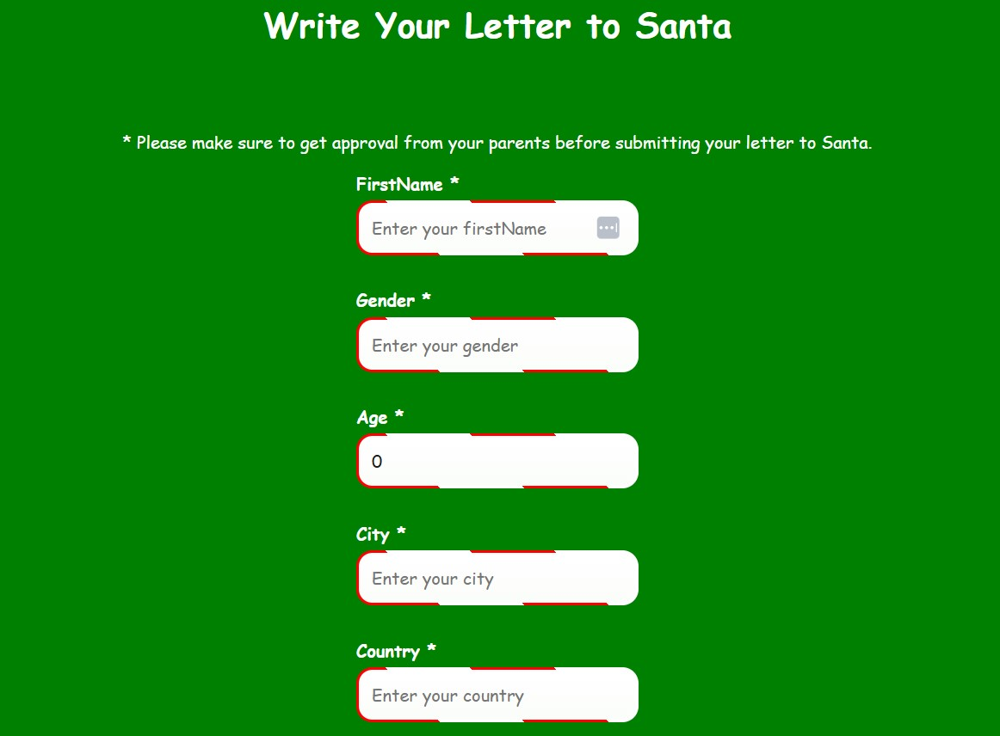

# **SantaMail**

---

## **Getting Started**

SantaMail is a festive project that allows users to send a templated Christmas message to Santa, which is delivered via Gmail using **Nodemailer**. The application includes a delightful frontend and backend, creating a seamless experience for holiday cheer!

---

## **Prerequisites**

Before running the application, ensure the following are installed on your system:

- **Node.js**: Required to run the React frontend.
- **.NET Core SDK**: Needed to build and run the backend.
- **Yarn** (or **npm**): To manage frontend dependencies.

---

## **Installation**

1. Clone the repository:
    ```bash
    git clone https://github.com/username/SantaMessage.git
    cd SantaMessager
    ```

2. Install frontend dependencies:
    ```bash
    cd frontend
    yarn install
    ```

3. Install backend dependencies:
    ```bash
    cd ../backend
    yarn install
    ```

---

## **Running the Application**

1. **Start the Backend**:
    ```bash
    cd backend
    node server.js
    ```

2. **Start the Frontend**:
    ```bash
    cd ../frontend
    yarn start
    ```

3. Open your browser and visit **[http://localhost:3000](http://localhost:3000)**.

You can explore the Christmas-themed homepage, write a letter to Santa, and send your message directly to Gmail.

---

## **Application Images**

Here are some highlights of the application:

- **Homepage**:  
  

- **Write a Letter to Santa**:  
  

- **Message Sent Confirmation**:  
  

- **Email Preview**:  
  

---

## **Developer Workflow**

### **Snippets for Speed**
- Leverage **JavaScript and TypeScript Nightly** for enhanced coding speed and type support.
- Utilize **ES7 React/Redux/GraphQL/React-Native snippets** for:
   - Quickly generating components (`rfc`, `rcc`).
   - Establishing Redux connections (`rconnect`).
   - Writing hooks (`useState`, `useEffect`).

### **JSX Usage**
- Use JSX for a seamless combination of logic and UI. React elements will be automatically compiled, allowing you to focus on building features without manual transformations.

### **Linting**
- Run **ESLint** frequently to maintain clean, bug-free code:
   ```bash
   yarn lint
   ```

---

## **Troubleshooting**

If you encounter issues with the backend, ensure you set the required Node.js environment variable:

```bash
set NODE_OPTIONS=--openssl-legacy-provider
```

---

## **Contributing**

1. Fork the repository and create a feature branch:
    ```bash
    git checkout -b feature/your-feature
    ```

2. Commit your changes:
    ```bash
    git commit -m "Add your feature"
    ```

3. Push your branch:
    ```bash
    git push origin feature/your-feature
    ```

4. Open a pull request and let the Christmas magic shine!

---

## **License**

This project is licensed under the **MIT License**. See the `LICENSE` file for details.